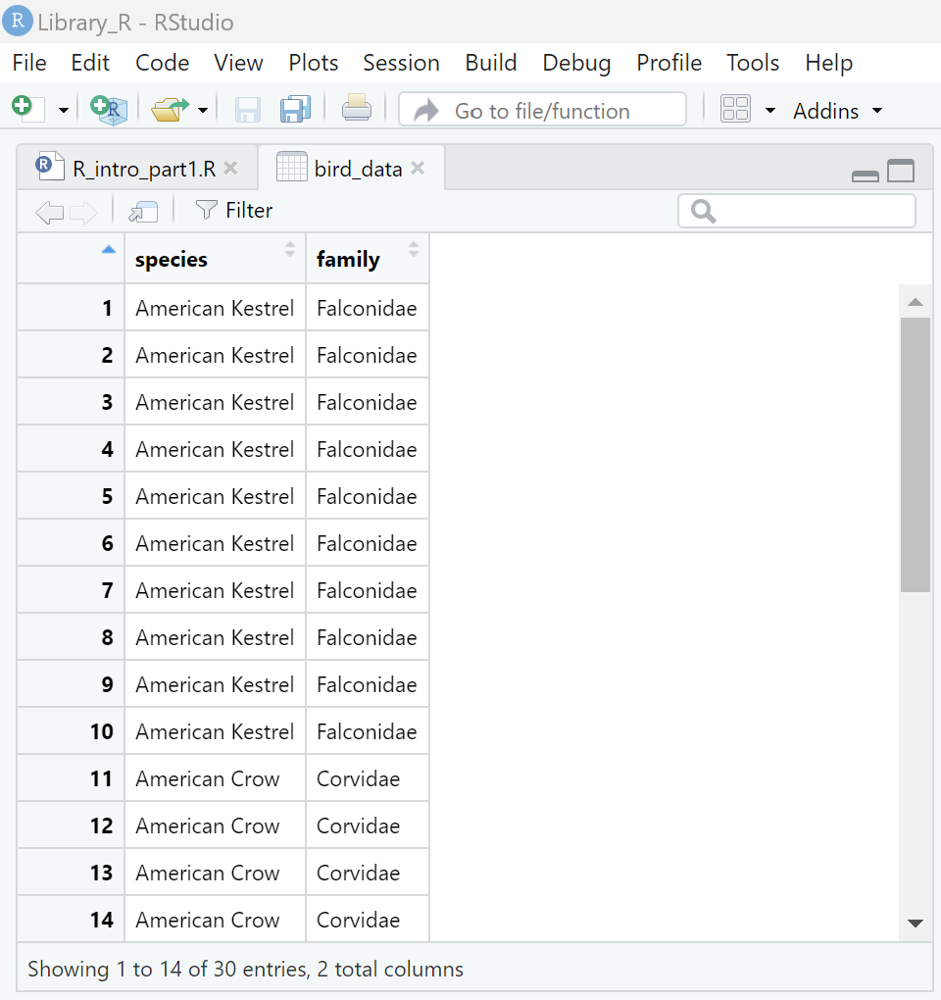

<br>

Greetings! This tutorial was originally commissioned by Tulane University's Howard-Tilton Memorial Library. It is targeted towards faculty, post-docs, graduate students, and undergraduates new to R. Its goal is to provide the necessary foundation for processing and analyzing your own data. Please see the Table of Contents on the left side of this window for an overview. Additional information on project management, packages, "tidy R," and data visualizations will be provided in Part II.

Happy coding!

# **Download R & RStudio**

### Fortunately, getting R and RStudio set up on your machine isn't too complicated. Just follow these steps:

1.  [Download R from The Comprehensive R Archive & Network (CRAN).](https://cran.rstudio.com/) <br>


2.  Install R. Default settings will work for most people. You should not need any shortcuts since RStudio will access R for us.

3.  [Download RStudio from Posit.](https://posit.co/download/rstudio-desktop/) (You may need to scroll down the page a bit for downloads for Mac, older versions of Windows, and 32-bit systems).

4.  Install RStudio. Default settings should be fine, but now you'll want to make sure you have an easily accessible shortcut!

# **Navigating RStudio**

### RStudio is divided into 4 movable panes:

<br> <font size="5"> 1. Console </font><br> This is where we run our R code/commands

<font size="5"> 2. Source </font><br> This is where we write, run, save, and edit **scripts**, which are text files containing our R code and can consist of many commands built off of each other.

::: callout-note
## <font size="5"> Note </font>

<font size="4"> You may not see this pane if it's your first time starting up R Studio because you likely won't have an open script\...more on this soon. </font>
:::

<font size="5"> 3. Environment, History, Connections, Tutorial </font><br> We use this pane mostly for the Environment, which is where our data, functions, and other objects will be stored and accessed.

<font size="5"> 4. Files, Plots, Packages, Help, Viewer, Presentation </font><br> I tend to keep this pane minimized until I need it. It can be very handy when you want to access a project file, create a figure, or reference a function's help section.

::: callout-tip
## <font size="5"> Try it </font>

<font size="4"> You can change pane sizes by clicking and dragging pane edges or by using the buttons in the figure below: </font>
:::


### Personalizing Your RStudio

The four panes can be relocated to whichever screen quadrants you'd like: <br> `Tools -> Global Options -> Pane Layout`

You can adjust fonts, text sizes, color schemes, etc. under Global Options as well: <br> `Tools -> Global Options -> Appearance` <br>

# **Console Calculator**

You can run basic and complex calculations, or even more complicated code, in the Console pane.

::: callout-note
## <font size="5"> Note </font>

<font size="4"> The colorful lines below are R code! Entering each line of code in the Console yields R output. The `[1]` in the output shows the positional order of the leftmost result your code returned on that line. In this case, it's a single number on a single line. Many analyses will return multiple results listed one after the other across several lines, so these bracketed numbers can be useful for examining lengthier output. We'll see this later! </font>
:::

::: callout-tip
## <font size="5"> Try it </font>

<font size="4"> Run some basic calculations by typing or copying them into the Console and hitting the "Enter" or "Return" key. </font>
:::


::: {.cell}

```{.r .cell-code}
1 + 1
```

::: {.cell-output .cell-output-stdout}
```
[1] 2
```
:::

```{.r .cell-code}
2 / 4
```

::: {.cell-output .cell-output-stdout}
```
[1] 0.5
```
:::

```{.r .cell-code}
3 * (5 - 3)^2
```

::: {.cell-output .cell-output-stdout}
```
[1] 12
```
:::
:::


# **Your First R Script**

The R Console is great for one-off calculations, but what if you want to create, edit, and run code more than once? R scripts can solve this problem!

-   Click on the "New File" button (a white square with green plus drop-down under File) and select "R Script
-   Now click `File -> Save As...`, give your file a meaningful name like "R_intro_part1", and save it somewhere you can find it again.

{width="400"}

From here on out, we'll be entering our code into our new R scripts. All of this could alternatively be run in the Console, but to revisit and edit code entered into the Console, you'd have to double click on past code under the History tab in the Environment panel, cycle through the history using `Ctrl/Cmd + [up arrow]` in the Console, or scroll up and copy/paste code back into the Console.

## Running code in R scripts

There are a few ways to run code contained in a script:

-   Run the current line your cursor is on (it doesn't need to be at the end).

    -   Click the `Run` button at the top right corner of your Source pane (above your script)

    -   Hit `Ctrl/Cmd + Enter`

-   Run the entire script

    -   Highlight everything and click `Run`

    -   `Ctrl/Cmd + A + Enter`

-   Re-run the previous line

    -   Click the button immediately to the right of `Run`, which shows a blue arrow turning back and a green arrow pointing forward.

    -   `Ctrl/Cmd + Alt/Opt + P`

::: callout-tip
## <font size="5"> Try it </font>

<font size="4"> Run some basic calculations entered into your script. </font>
:::


::: {.cell}

```{.r .cell-code}
2 * 3 * 4
```

::: {.cell-output .cell-output-stdout}
```
[1] 24
```
:::

```{.r .cell-code}
1 / 7
```

::: {.cell-output .cell-output-stdout}
```
[1] 0.1428571
```
:::
:::


## The Almighty `#`Hashtag

In addition to editing and running our R code, scripts are also great places to organize and **comment** on our code. The R language has reserved the `#` symbol for commenting and organization purposes. Here are some best practices to keep your scripts organized and understandable (always good when returning to your work after time away or sharing with collaborators!).

-   Create collapsible sections using `# Section Title ----`

-   Annotate your code with comments explaining what the code does and why. Each comment should start at the beginning of a line and should be preceded by a `#` and a single `Space`.

-   Mute, or **comment out**, code you *don't* want to run by putting a `#` in front of it.

    -   To comment out multiple lines, highlight them and hit `Ctrl/Cmd + Shft + C`

::: callout-note
## <font size="5"> Note </font>

<font size="4"> All of these practices are on display below. </font>
:::

# **Creating Objects**

**Objects** in R are containers that store information. Using the `<-` operator (`Alt/Opt + Hyphen [-]`), you can save information as objects in your Environment pane. This is similar to saving a file in a folder on your computer, but you can delete, recreate, rename, and edit that object with the code written in your script.

Assigning data to objects allows you to "call", or access, the data whenever you want.

## Single-value Numeric Examples

::: callout-tip
## <font size="5"> Try it </font>

<font size="4"> 1. Enter the code below in your new script to save some objects, use them in operations, and see the results. <br> 2. Employ good organizational practices using `#`. </font>
:::


::: {.cell}

```{.r .cell-code}
# Creating Objects ----

# Objects can be single values. In the line below, we assign a value to an object with a descriptive name.
ten <- 10

# In this line, we "call" the object, which will produce its value in the Console output when run.
ten

# Objects can also contain the results of calculations or functions.
twenty <- 4 * 5
twenty

# And we can combine objects into more complex calculations.
ten + twenty

# NOTE: object names cannot include spaces. Instead, use underscores to separate words.
ten_twenty <- ten + twenty
ten_twenty + 10

# This code is "commented out" and won't run:
# ten * 2 - twenty
```
:::


Our only output should be the following for our two objects and the two sums we calculated using those objects:


::: {.cell}

```
## [1] 10
## [1] 20
## [1] 30
## [1] 40
```
:::


## Overwriting Objects

When working in most word processing programs, if you try to save a document with the same name as another file, the program will give you a warning. R does [NOT]{.underline} do that, so you need to be organized and intentional with how you name and re-name your objects.

::: callout-tip
## <font size="5"> Try it </font>

<font size="4"> Experiment with reassigning objects. </font>
:::


::: {.cell}

```{.r .cell-code}
# Here "math" = 15
math <- 3*5
math
```

::: {.cell-output .cell-output-stdout}
```
[1] 15
```
:::

```{.r .cell-code}
# But as soon as we run this code, every time we call "math" from now on, we'll get 25 instead.
math <- ten + math
math
```

::: {.cell-output .cell-output-stdout}
```
[1] 25
```
:::

```{.r .cell-code}
math - ten_twenty
```

::: {.cell-output .cell-output-stdout}
```
[1] -5
```
:::
:::


## Careful!

R is case-sensitive and sensitive to typos, too! In fact, typos are the most common source of errors in R. Any time you've got a problem, first **check for typos!**


::: {.cell}

```{.r .cell-code}
# Calling this object works as intended.
ten
```

::: {.cell-output .cell-output-stdout}
```
[1] 10
```
:::

```{.r .cell-code}
# This won't work because of incorrect capitalization.
Ten
```

::: {.cell-output .cell-output-error}
```
Error in eval(expr, envir, enclos): object 'Ten' not found
```
:::

```{.r .cell-code}
# This typo will yield an error as well.
twetny
```

::: {.cell-output .cell-output-error}
```
Error in eval(expr, envir, enclos): object 'twetny' not found
```
:::
:::


## Strings/Characters

Data come in many formats, or **classes**. The objects we saved above were all what you might call "integer" or "numeric" classes. Another common data format is the **character** class, or text-based data. In R, **strings** are just character class text data in between quotation marks!

::: callout-tip
## <font size="5"> Try it </font>

<font size="4"> Make and manipulate some string objects. </font>
:::


::: {.cell}

```{.r .cell-code}
# Put text in quotations to create a string.
tu <- "Tulane University"
loc <- "New Orleans, LA"

tu
```

::: {.cell-output .cell-output-stdout}
```
[1] "Tulane University"
```
:::

```{.r .cell-code}
loc
```

::: {.cell-output .cell-output-stdout}
```
[1] "New Orleans, LA"
```
:::
:::


::: callout-note
## <font size="5"> Note </font>

<font size="4"> As you might expect, character and numeric classes are incompatible! And strings can't be used mathematically. What happens if you try to run the code below in your script? </font>
:::


::: {.cell}

```{.r .cell-code}
# You can't do math with text
tu + 10

# Nor can you combine string objects in ways you might think, but we'll learn how soon.
tu + loc
tu loc
tu, loc
```
:::


# **Vectors, Functions, Help, Cleaning**

## Vectors

**Vectors** are common objects in R. They're just lists of variables and can contain numbers, expressions, character strings, and more. You can think of these as analogous to a single column of data in Excel.

To create vectors, we have to use a **function**, which is just a pre-packaged code used to accomplish a specific task. Functions in R are written in the format `function.name(data = ..., arguments = ...)`, where additional `arguments` feed extra instructions to the function on how to manipulate the input `data`.

The function for creating a vector is `c()`. `c` stands for "Combine Values into a Vector or List," but who wants to write all that out every time?

::: callout-tip
## <font size="5"> Try it </font>

<font size="4"> Create some vectors of your own. </font>
:::


::: {.cell}

```{.r .cell-code}
# Vectors ----

# Vectors combine values separated by commas. Here we're telling the c() function to combine three character values. We are not feeding the function any additional arguments.
birds <- c("Kestrel", "Crow", "Robin")
birds
```

::: {.cell-output .cell-output-stdout}
```
[1] "Kestrel" "Crow"    "Robin"  
```
:::

```{.r .cell-code}
# This works for numbers as well as characters.
a <- c(1, 2, 3, 4)
a
```

::: {.cell-output .cell-output-stdout}
```
[1] 1 2 3 4
```
:::

```{.r .cell-code}
# But if you combine the two, the numbers will be converted to characters.
# NOTE: We haven't assigned this vector to an object! As a result, it won't appear in your Environment after you run it.
c("a", 1, "b", 2, "c", 3)
```

::: {.cell-output .cell-output-stdout}
```
[1] "a" "1" "b" "2" "c" "3"
```
:::

```{.r .cell-code}
# We can use the colon symbol to create numeric runs from A to B.
a <- c(1:4)
a
```

::: {.cell-output .cell-output-stdout}
```
[1] 1 2 3 4
```
:::

```{.r .cell-code}
# Here's a longer vector.
ten_to_sixty <- c(10:60)

# Notice how we get more [1] in our output now. The numbers will change depending on the width of your Console when you run the code.
# You can experiment with this by dragging your Console edges left or right and rerunning the code. 
ten_to_sixty
```

::: {.cell-output .cell-output-stdout}
```
 [1] 10 11 12 13 14 15 16 17 18 19 20 21 22 23 24 25 26 27 28 29 30 31 32 33 34
[26] 35 36 37 38 39 40 41 42 43 44 45 46 47 48 49 50 51 52 53 54 55 56 57 58 59
[51] 60
```
:::
:::


## Function examples

R is full of helpful functions, and since it's entirely open-source, people are always coming up with new ones! This means there's a pre-packaged function out there for almost all of your needs.

::: callout-tip
## <font size="5"> Try it </font>

<font size="4"> Test out some common functions below. What do they do? </font>
:::


::: {.cell}

```{.r .cell-code}
# Function Practice ----

# Here are a few functions that can take additional arguments, but we haven't supplied any. Instead, we're using the default methods and supplying only the input data.
median(a)
sum(a)
mean(ten_to_sixty)

# Here are a couple common functions where we provide input data followed by arguments. What does each argument do?
round(2/3, digits = 2)
round(2/3, digits = 4)

sort(a, decreasing = TRUE)

# Here's a function that takes 2+ sources of input data. In this case, we're inputting a single value (the character string "American") and an object (birds).
# What happens here?
am_birds <- paste("American", birds)
am_birds

# Here we rearrange the order of our input data in paste() and provide an argument where we set `sep` (short for separate) equal to "nothing" as denoted by two quotations with nothing in between them.
# How does this change the results of the paste() function?
paste(birds, "s", sep = "")

# Many functions can take multiple arguments
x <- rep(a, times = 3)
y <- rep(a, each = 3)
z <- rep(a, each = 3, times = 3)

# Compare the output
x
y
z
```
:::

::: {.cell}

:::


## Help in R

If you're ever unsure of how a function works, what arguments it takes, or even if you just want examples, R contains the answers! You can search for help in the Help tab of the Files pane. Or...

::: callout-tip
## <font size="5"> Try it </font>

<font size="4"> Query R for help by entering these lines directly into your *console*, not your script, one at a time. </font>
:::


::: {.cell}

```{.r .cell-code}
# Entering a ? before a function name will pull up the help page for that function
?c
?paste
?rep
?sort
?round

# If you don't know the name of the function, you may be able to find it by putting two question marks before a keyword.
??student

# Wrap phrases in quotes to search for them.
??"linear regression"
```
:::


::: callout-note
## <font size="5"> Note </font>

<font size="4"> There are a LOT of great online resources if you want more help in R and RStudio. For starters, you can click the `Help` tab, and then the picture of the Home button. More advanced help can usually be found on [StackOverflow](https://stackoverflow.com/questions/tagged/r) -- every R coder's best friend. </font>
:::

## Avoiding clutter

It's always a good idea to keep a tidy work space. R has a function called `rm()` (short for "remove") that you can use to do targeted house cleaning.

-   You can always rerun your script to get your objects back after removing them!
-   If you want to erase all objects, you can click the broom button in the Environment panel.
    -   There are similar "clearing" broom buttons in the Console pane and under the History and Plots tabs.

::: callout-tip
## <font size="5"> Try it </font>

<font size="4"> Let's get rid of extra objects we don't need anymore. </font>
:::


::: {.cell}

```{.r .cell-code}
rm(a, birds, loc, math, ten, ten_to_sixty, ten_twenty, tu, twenty, x, y, z)
```
:::


# **Data Frames**

If vectors are equivalent to columns in an Excel or .csv file, then **data frames** are equivalent to the file or sheet itself! They're just one or more rows and one or more columns of data. In R, we commonly create, import, and combine data frames. Let's combine all three approaches to build a dataframe about those birds from earlier.

## Creating

Like most tabular information, data frames are organized by column. In R, they're created by column too within `data.frame()`. All we have to do is set a user-defined column name equal to a value, vector, or object.

::: callout-tip
## <font size="5"> Try it </font>

<font size="4"> 1. Start a new collapsible section heading. <br> 2. Next, build your own data frame by defining your columns. <br> 3. Combine multiple functions to get one end result </font>
:::


::: {.cell}

```{.r .cell-code .code-overflow-scroll}
# Working with Data Frames ----

# Create data frames using data.frame()
# Here we'll create two columns, one called "species" and one called "family," and we'll fill each column with data.
# NOTE: the indentation here! When code for a single function starts to get too long, it can be hard to visually digest. 
# In these instances, hit the "Enter/Return" key after each argument in a function, i.e., after the commas. 
# RStudio will automatically indent each new line for us so that they fall below their function's opening parenthesis.
bird_data <- data.frame(species = rep(am_birds, each = 12),
                        family = rep(c("Falconidae", "Corvidae", "Turdidae"),
                                     each = 12))
```
:::


Congratulations! In addition to making your first data frame, you just combined [*three*]{.underline} functions for the first time by nesting `c()` inside `rep()` inside `data.frame()`! Take some time to inspect each component of this code to make sure you're clear on what the three functions did. You may find it helpful to start with the innermost piece (`c()`) and work your way out.

::: callout-note
## <font size="5"> Note </font>

<font size="4"> When nesting functions, your parentheses really start to pile up. You can put your cursor after a closing parenthesis to highlight its opening parenthesis. One nice perk of RStudio is that it will warn you if you have too many or too few! </font>
:::

## Viewing

Let's check out our results. There are a few ways to view your them:

1.  Type the name of your data frame into the Console and hit Enter.


    ::: {.cell}
    
    ```{.r .cell-code}
    # NOTE: This gets quite cumbersome for large data sets, especially ones with lots of columns since the Console can't scroll left and right.
    bird_data
    ```
    
    ::: {.cell-output .cell-output-stdout}
    ```
                species     family
    1  American Kestrel Falconidae
    2  American Kestrel Falconidae
    3  American Kestrel Falconidae
    4  American Kestrel Falconidae
    5  American Kestrel Falconidae
    6  American Kestrel Falconidae
    7  American Kestrel Falconidae
    8  American Kestrel Falconidae
    9  American Kestrel Falconidae
    10 American Kestrel Falconidae
    11 American Kestrel Falconidae
    12 American Kestrel Falconidae
    13    American Crow   Corvidae
    14    American Crow   Corvidae
    15    American Crow   Corvidae
    16    American Crow   Corvidae
    17    American Crow   Corvidae
    18    American Crow   Corvidae
    19    American Crow   Corvidae
    20    American Crow   Corvidae
    21    American Crow   Corvidae
    22    American Crow   Corvidae
    23    American Crow   Corvidae
    24    American Crow   Corvidae
    25   American Robin   Turdidae
    26   American Robin   Turdidae
    27   American Robin   Turdidae
    28   American Robin   Turdidae
    29   American Robin   Turdidae
    30   American Robin   Turdidae
    31   American Robin   Turdidae
    32   American Robin   Turdidae
    33   American Robin   Turdidae
    34   American Robin   Turdidae
    35   American Robin   Turdidae
    36   American Robin   Turdidae
    ```
    :::
    :::


2.  Use the `View()` function. [*WARNING*]{style="color: red;"}: this function *must* be capitalized! BUT, it's a lot more manageable than trying to inspect big data directly in the Console. Usually you don't want to put `View()` in your script, however, so type or copy it into your Console instead. You should have the same results open up in a new tab beside your script in the Source panel.


    ::: {.cell}
    
    ```{.r .cell-code}
    View(bird_data)
    ```
    :::


    {width="450"}

3.  Lastly, you can click on the name of your data frame in the Environment tab for the same effect. Note also that the Environment tab will show you how many rows (obs.) your data frame contains and how many columns (variables). We can also see that the `am_birds` object is a character class (chr) containing three values.

    {width="450"}

## Importing

If you're working through this tutorial, you probably have data of your own that you hope to analyze in R! Let's learn how to import data from other sources.

::: callout-note
## <font size="5"> Note </font>

<font size="4"> It's good practice to use .csv files for data import and export. They're less bulky (which makes R run much faster and leaves more memory for analyses and object storage), there are fewer odd formatting issues, you don't have to deal with sheets, and they're more easily shared across platforms. </font>
:::

::: callout-tip
## <font size="5"> Try it </font>

<font size="4"> 1. Import some bird measurement data to accompany this tutorial directly from the web. <br> 2. Download the file, copy the complete file path (location on your computer) including the file name and the .csv extension to your clipboard. <br> 3. **Read in** the data to R using `read.csv()` with the appropriate set up for your machine. <br> 4. Examine your new data using one of the methods above. </font>
:::


::: {.cell}

```{.r .cell-code}
# Data can be imported into R from various sources. Here you'll learn how to do it directly from the web and from your own machine.

# In both cases, we'll use read.csv() because that's the filetype of the data we're importing.

# When files are hosted directly on a website, you can import it by quoting the file's url inside the read.csv function.
bird_csv <- read.csv("https://libguides.tulane.edu/ld.php?content_id=70580527")

# You can use this same function to import local data from your machine by feeding the file path into the function. You can try this out by downloading the data file from the link above or from the "Data_In" folder in this project's GitHub repository (https://github.com/mellisbirds/Intro_to_R.git).

# Here's how it works:

# Windows users must replace the \ in their pathways with / or \\ in order for R to recognize it.
bird_csv <- read.csv("C:/Users/Jane Doe/Desktop/intro1_bird_data.csv")

# For Mac Users:
bird_csv <- read.csv("/Users/Jane Doe/Desktop/intro1_bird_data.csv")

# Now that you've read in the new data, look it over using what you learned earlier.
```
:::

::: {.cell}

:::


::: callout-note
## <font size="5"> Notes </font>

<font size="4"> In *Intro to R Part II*, we'll learn about project management, which makes importing and exporting data much more efficient! </font>

<font size="3"> The data I've provided for importing practice are fictional data I created, but they're based on actual average values from Tobias et al. (2022).</font> <br> <font size="2"> Tobias, Joseph A., et al. "AVONET: morphological, ecological and geographical data for all birds." *Ecology Letters* 25.3 (2022): 581-597. </font>
:::

## Combining

There are several different ways to combine data frames in r, but the most straightforward "bind" data frames together by column or row. Unsurprisingly, column binding adds the columns of one data frame *beside* those of another; row binding adds the rows of one column *underneath* the rows of another. The functions for these two methods are `cbind()` and `rbind()`, respectively.

::: callout-note
## <font size="5"> Note </font>

<font size="4"> If your rows or columns don't match up before binding, they won't match up after binding either using this approach! </font>
:::

::: callout-tip
## <font size="5"> Try it </font>

<font size="4"> Combine the data you created with bird names and families with the measurement data you imported. </font>
:::


::: {.cell}

```{.r .cell-code}
# cbind() takes multiple data or object inputs, but they must have the same number of rows.

# Do our data have the same number of rows? What about columns?

# Objects within the function's parentheses will be bound together in the order you enter them.
bird_data <- cbind(bird_data, bird_csv)

# NOTE: You just overwrote the bird_data object! If you accidentally run the code above again, you will bind bird_csv to the new object, which will result in duplicate columns! If necessary, go back a few steps to recreate the original bird_data object.
```
:::


# **Examine Data**

It's always a good idea to inspect your data. Here are some common ways of doing so:

::: callout-tip
## <font size="5"> Try it </font>

<font size="4"> Give data frame inspection a whirl. Pay special attention to the last bit of output from `str()` </font>
:::


::: {.cell}

```{.r .cell-code}
# Data Inspection ----

# In addition to View(), you can also use functions to examine pieces of your data and its structure.

colnames(bird_data)
nrow(bird_data)
head(bird_data, n = 5)
tail(bird_data, n = 3)

# This one also shows object and data classes!
str(bird_data) # str = structure
```
:::


Does anything unusual from the `str()` output catch your eye?


::: {.cell}
::: {.cell-output .cell-output-stdout}
```
'data.frame':	36 obs. of  5 variables:
 $ species       : chr  "American Kestrel" "American Kestrel" "American Kestrel" "American Kestrel" ...
 $ family        : chr  "Falconidae" "Falconidae" "Falconidae" "Falconidae" ...
 $ id            : chr  "kestrel1" "kestrel2" "kestrel3" "kestrel4" ...
 $ wing_length_mm: num  175 179 201 183 NA ...
 $ mass_g        : num  109 NA 130 113 112 ...
```
:::
:::


# **Common Data Manipulators**

## `$`

When examining the `str()` output, you probably noticed dollar signs (`$`) in front of our data frame's column names and **`NAs`** in some of the numeric columns. Those `NAs` stand for "Not Available", and it's equivalent to a blank cell in Excel; it's an empty space in our data frame with missing data.

But let's look at `$` before we get any further with `NAs`. In R, we can use **`$`** to reference columns within our dataframe. The `str()` output above uses them to tell us, hey, these are your columns!

::: callout-tip
## <font size="5"> Try it </font>

<font size="4"> 1. Use the `$` operator to access and edit individual variables in an object, in this case, columns in a data frame. <br> 2. Use `$` to create and remove columns. </font>
:::


::: {.cell}

```{.r .cell-code}
# $ Operator ----

# You may have also noticed some differences in significant figures in our numeric variables while inspecting the data above. 
head(bird_data$wing_length_mm, 5)
## [1] 175.3 179.2 200.7 182.8    NA

head(bird_data$mass_g, 5)
## [1] 108.732      NA 129.515 112.586 112.163
```
:::

::: {.cell}

```{.r .cell-code}
# We can overwrite columns with edited versions of themselves using $ and <- . Let's fix the sig figs on mass_g by setting the mass_g column equal to a rounded version of itself.
bird_data$mass_g <- round(bird_data$mass_g, digits = 1)

# Check to make sure mass_g is now rounded to 1 decimal place.
head(bird_data$mass_g)
```

::: {.cell-output .cell-output-stdout}
```
[1] 108.7    NA 129.5 112.6 112.2 131.6
```
:::

```{.r .cell-code}
# You can also use $ to make new columns altogether or eliminate existing ones. Let's try both.

# First, we can determine the relationship between mass and wing length by dividing the former by the latter.
bird_data$mass_to_wing <- round(bird_data$mass_g / bird_data$wing_length_mm, 2)

# Perhaps we don't need that ID column. We can assign it `NULL` to remove it.
bird_data$id <- NULL

# Remember to check your work! $id should have disappeared. 
head(bird_data, 4)
```

::: {.cell-output .cell-output-stdout}
```
           species     family wing_length_mm mass_g mass_to_wing
1 American Kestrel Falconidae          175.3  108.7         0.62
2 American Kestrel Falconidae          179.2     NA           NA
3 American Kestrel Falconidae          200.7  129.5         0.65
4 American Kestrel Falconidae          182.8  112.6         0.62
```
:::
:::


## `[`

In R, square brackets `[` are an operator called "Extract" and can be used to extract and replace values in an object. Often, `[` references rows, columns, or individual cells in a data frame. Using similar ideas as the `$` above, we can use `[` to target specific parts of our data for editing. Another common use of `[` is to extract data from an object if it meets specified criteria.

There are a few ways to use `[` at the basic level with data frames. In all cases, we tack our brackets onto the data frame or object we'd like to extract from and insert our query.

-   Extracting values from a data frame

    -   `bird_data[row, column]`

-   Extracting values from a column

    -   `bird_data$mass_g[row]`

-   Specifying search criteria

    -   `object[object operator condition]`

    -   Example below!

::: callout-warning
## <font size="5"> Careful! </font>

<font size="4"> Using `[` to edit data can be risky because it references values in a data frame based on horizontal and vertical positions. Those positions are static, but the rows and columns themselves may change, thereby changing the values extracted by `[`. For example, the 3rd column of `bird_data` originally contained `$id`, but now it contains `$wing_length_mm`! </font>
:::

::: callout-tip
## <font size="5"> Try it </font>

<font size="4"> 1. Use the `[` operator to search and edit `bird_data`. <br> 2. Use `[` to find values meeting search criteria. </font>
:::


::: {.cell}

```{.r .cell-code}
# [ Extract ----

# You can extract and edit values in a specified row and column with [.
# In our most recent output from head(), we saw an NA value in the 2nd row of the mass_g column, which currently is the 4th column. Go back and take a look. Then,...
# Let's check the contents of that cell. And remember, the query order is [row, column]
bird_data[2, 4]
```

::: {.cell-output .cell-output-stdout}
```
[1] NA
```
:::

```{.r .cell-code}
# Yep, that's our NA.
# Suppose you know the missing value that's supposed to be in that cell and want to fill it in. All we have to do is assign the value to that cell and check our work.
bird_data[2, 4] <- 110.2
head(bird_data, 3)
```

::: {.cell-output .cell-output-stdout}
```
           species     family wing_length_mm mass_g mass_to_wing
1 American Kestrel Falconidae          175.3  108.7         0.62
2 American Kestrel Falconidae          179.2  110.2           NA
3 American Kestrel Falconidae          200.7  129.5         0.65
```
:::

```{.r .cell-code}
# A less risky maneuver would be to specify the column name.
bird_data$mass_g[2] <- 111.2
head(bird_data, 3)
```

::: {.cell-output .cell-output-stdout}
```
           species     family wing_length_mm mass_g mass_to_wing
1 American Kestrel Falconidae          175.3  108.7         0.62
2 American Kestrel Falconidae          179.2  111.2           NA
3 American Kestrel Falconidae          200.7  129.5         0.65
```
:::

```{.r .cell-code}
# We could now re-run the entire mass to wing ratio code from above to update it, or manually update that one cell with the correct value.
# We know it should be in the same row as the cell we just fixed and draw from the mass and wing values in that row. So,...
bird_data$mass_to_wing[2] <- round(bird_data$mass_g[2] /
  bird_data$wing_length_mm[2], 2)

# Check to make sure it worked.
head(bird_data, 3)
```

::: {.cell-output .cell-output-stdout}
```
           species     family wing_length_mm mass_g mass_to_wing
1 American Kestrel Falconidae          175.3  108.7         0.62
2 American Kestrel Falconidae          179.2  111.2         0.62
3 American Kestrel Falconidae          200.7  129.5         0.65
```
:::
:::

::: {.cell}

```{.r .cell-code}
# What happens if you don't provide [ with both a row and column?
bird_data[, 4]
bird_data[2, ]
# Can you determine what's happening?
# This can actually be a useful tool in the right situation!


# [ can also be used to add and remove entire rows or columns. For example, we have some more NAs in row 13, and it looks like the wing_length_mm value is an outlier. We could choose to remove that entire row by incorporating a simple - symbol.
# This extracts all rows EXCEPT row 13 across all columns.
bird_data <- bird_data[-13, ]

# Take a look.
View(bird_data)
```
:::

::: {.cell}

```{.r .cell-code}
# And we can extract snippets of our dataframe with : and c().
# Extract rows 20:25, all columns
bird_data[25:35, ]
```

::: {.cell-output .cell-output-stdout}
```
          species   family wing_length_mm mass_g mass_to_wing
25 American Robin Turdidae          120.8   72.1         0.60
26 American Robin Turdidae          110.1     NA           NA
27 American Robin Turdidae          135.4   84.1         0.62
28 American Robin Turdidae          128.5   79.7         0.62
29 American Robin Turdidae             NA   70.2           NA
30 American Robin Turdidae          139.5   87.9         0.63
31 American Robin Turdidae          131.3   83.9         0.64
32 American Robin Turdidae          124.0   75.2         0.61
33 American Robin Turdidae          136.0   80.6         0.59
34 American Robin Turdidae          135.8   85.5         0.63
35 American Robin Turdidae          135.2   82.5         0.61
```
:::

```{.r .cell-code}
# Extract rows 20:25 for columns 1, 3, and 5
bird_data[25:35, c(1, 3, 5)]
```

::: {.cell-output .cell-output-stdout}
```
          species wing_length_mm mass_to_wing
25 American Robin          120.8         0.60
26 American Robin          110.1           NA
27 American Robin          135.4         0.62
28 American Robin          128.5         0.62
29 American Robin             NA           NA
30 American Robin          139.5         0.63
31 American Robin          131.3         0.64
32 American Robin          124.0         0.61
33 American Robin          136.0         0.59
34 American Robin          135.8         0.63
35 American Robin          135.2         0.61
```
:::
:::


Great work! Now let's query our data following the `object[object operator condition]` pattern. Here, operators are symbols used to specify logical conditions that you're probably familiar with, but with a few twists:

-   `<` Less than

-   `>` Greater than

-   `<=` Less than or equal to

-   `>=` Greater than or equal to

-   `==` Exactly equal to (You *must* use [two]{.underline} `=` symbols for this to work!)

-   `!=` Is *NOT* equal to

-   `&` Can be used in conjunction with other operators to specify "object must meet condition one *AND* condition two"

-   `|` "Object must meet condition one *OR* condition two"

-   `%in%` Object1 is in object2


::: {.cell}

```{.r .cell-code}
# We can ask R to tell us which items in an object meet a certain condition with the pattern "object operator condition."
# Here we have an object (wing length column), an operator (>) and a condtion (200 mm).
bird_data$wing_length_mm > 150
```

::: {.cell-output .cell-output-stdout}
```
 [1]  TRUE  TRUE  TRUE  TRUE    NA  TRUE  TRUE  TRUE  TRUE  TRUE  TRUE  TRUE
[13]  TRUE  TRUE  TRUE  TRUE    NA  TRUE  TRUE  TRUE  TRUE  TRUE  TRUE  TRUE
[25] FALSE FALSE FALSE FALSE    NA FALSE FALSE FALSE FALSE FALSE FALSE FALSE
```
:::

```{.r .cell-code}
# Notice how R only told us whether or not the values met that condition? 
# "object[object operator condition] will return all TRUE values.
bird_data$wing_length_mm[bird_data$wing_length_mm > 150]
```

::: {.cell-output .cell-output-stdout}
```
 [1] 175.3 179.2 200.7 182.8    NA 202.6 187.5 166.8 173.8 176.7 196.7 186.3
[13] 802.6 295.7 279.7 335.9    NA 245.8 309.8 281.7 267.4 287.8 268.4 275.5
[25]    NA
```
:::

```{.r .cell-code}
# As you can see, this starts to get pretty wordy. Sometimes it can help to create a smaller object, especially when you begin adding conditions!
# Reduce:
test <- bird_data$wing_length_mm

# Now use that reduced object to meet multiple conditions.
# This returns values between 150 and 200
test[test > 150 & test < 200]
```

::: {.cell-output .cell-output-stdout}
```
 [1] 175.3 179.2 182.8    NA 187.5 166.8 173.8 176.7 196.7 186.3    NA    NA
```
:::

```{.r .cell-code}
# This returns returns everything except values between 150 and 200
test[test <= 150 | test >= 200]
```

::: {.cell-output .cell-output-stdout}
```
 [1] 200.7    NA 202.6 802.6 295.7 279.7 335.9    NA 245.8 309.8 281.7 267.4
[13] 287.8 268.4 275.5 120.8 110.1 135.4 128.5    NA 139.5 131.3 124.0 136.0
[25] 135.8 135.2 133.9
```
:::
:::


## `subset()`

While `[` is a powerful tool, it has several important limitations:

-   Extracting by position is dangerous since columns and rows can move.

-   It still returned NA values.

-   Conditional queries only returned a single vector rather than the entire dataframe.

Most of these limitations can be addressed one way or another with clever fixes, but why bother if there are easier ways? Enter `subset()`! This function solves all of those problems and even manages to be a bit less wordy while doing it.

`subset()` follows the pattern `subset(data frame, column operator condition, arguments)`

::: callout-tip
## <font size="5"> Try it </font>

<font size="4"> 1. Whittle down your entire data frame to meet specific criteria using `subset()`. 2. Take `%in%` for a test drive. </font>
:::


::: {.cell}

```{.r .cell-code}
# Subset ----

# At its most basic, subset is pretty straightforward.
# This extracts all birds with a mass greater than 450 grams. 
# Notice there are no NAs in the column like there were with [. 
# Also, all columns are returned, so you can see which species fit the bill!
subset(bird_data, mass_g > 450)
```

::: {.cell-output .cell-output-stdout}
```
         species   family wing_length_mm mass_g mass_to_wing
14 American Crow Corvidae          295.7  455.7         1.54
15 American Crow Corvidae          279.7  460.0         1.64
16 American Crow Corvidae          335.9  508.5         1.51
17 American Crow Corvidae             NA  498.2           NA
19 American Crow Corvidae          309.8  487.4         1.57
22 American Crow Corvidae          287.8  452.6         1.57
```
:::

```{.r .cell-code}
# The most commonly used subset() argument "selects" columns to return rather than the entire data frame.
# This returns the same rows as above but only for two desired columns.
subset(bird_data, mass_g > 450, select = c(family, wing_length_mm))
```

::: {.cell-output .cell-output-stdout}
```
     family wing_length_mm
14 Corvidae          295.7
15 Corvidae          279.7
16 Corvidae          335.9
17 Corvidae             NA
19 Corvidae          309.8
22 Corvidae          287.8
```
:::

```{.r .cell-code}
# Here's another example where family MUST be "Corvidae" and individuals must have mass_to_wing less than 1.5 g/mm.
subset(bird_data, family == "Corvidae" & mass_to_wing < 1.5)
```

::: {.cell-output .cell-output-stdout}
```
         species   family wing_length_mm mass_g mass_to_wing
18 American Crow Corvidae          245.8  357.5         1.45
```
:::

```{.r .cell-code}
# Lastly, here's an introduction to %in%.
# This operator asks subset to return all rows where the data within the desired column (species) matches at least one item in the provided object (in this case a vector containing two strings)...and in this case, those rows must have a mass_to_wing greater than or = to 0.63 g/mm as well!
subset(bird_data, species %in% c("American Kestrel", "American Robin") & mass_to_wing >= 0.63)
```

::: {.cell-output .cell-output-stdout}
```
            species     family wing_length_mm mass_g mass_to_wing
3  American Kestrel Falconidae          200.7  129.5         0.65
6  American Kestrel Falconidae          202.6  131.6         0.65
8  American Kestrel Falconidae          166.8  106.4         0.64
9  American Kestrel Falconidae          173.8  109.6         0.63
11 American Kestrel Falconidae          196.7  125.4         0.64
30   American Robin   Turdidae          139.5   87.9         0.63
31   American Robin   Turdidae          131.3   83.9         0.64
34   American Robin   Turdidae          135.8   85.5         0.63
```
:::
:::


::: callout-warning
## <font size="5"> Careful! </font>

<font size="4"> R is always susceptible to typos. Any time you try matching a string with `==` or `%in%`, you have to be very careful there are no typos in your code OR in your data. If there are, your code won't return the expected results! </font>
:::

# **Handling Missing Data**

So far, we've learned two ways of handling missing data with `[`: replacing individual values and removing rows. `NAs` can really hamper your analyses, as we'll see below. Fortunately, R equips us with a few more ways of dealing with them.

::: callout-tip
## <font size="5"> Try it </font>

<font size="4"> 1. Remove `NAs` from objects within functions with `na.rm = TRUE`. <br> 2. Identify `NAs` by column with `subset` and `na.rm = TRUE`. <br> 3. Check for `NAs` in all rows and columns with `complete.cases()`. <br> 4. Remove all `NAs` with `na.omit()`.</font>
:::

## 1. `na.rm = TRUE`

To illustrate the issues raised by missing values, let's try to run some summary statistics on one species in our data frame: the American Robin.


::: {.cell}

```{.r .cell-code}
# Missing data ----

# First, we'll have to create an object containing just robins by subsetting the larger bird_data data frame
robins <- subset(bird_data, species == "American Robin")

# Next, let's try running some functions we learned earlier.
mean(robins$mass_g)
## [1] NA

median(robins$wing_length_mm)
## [1] NA
```
:::

::: {.cell}

```{.r .cell-code}
# Uh oh. Those NAs gummed up the works. There's a quick and easy fix, though!
# Add the na.rm (NA remove) argument.
mean(robins$mass_g, na.rm = TRUE)
## [1] 80.3

median(robins$wing_length_mm, na.rm = TRUE)
## [1] 133.9

# NOTE: This approach saves more data than eliminating entire rows to deal with NAs!
```
:::


## 2. `is.na()`

We can also identify rows with `NAs`, or the lack thereof, in *individual columns* using the `is.na()` function.


::: {.cell}

```{.r .cell-code}
# This code provides all the rows where the specified column contains an NA
subset(bird_data, is.na(mass_g))
```

::: {.cell-output .cell-output-stdout}
```
          species   family wing_length_mm mass_g mass_to_wing
13  American Crow Corvidae          802.6     NA           NA
26 American Robin Turdidae          110.1     NA           NA
```
:::
:::

::: {.cell}

```{.r .cell-code}
# Conversely, this removes all rows with an NA in the specified column.
# Just like != means "is not equal to," !is.na() means "is not NA."
# Give it a whirl. You shouldn't see any rows with NAs.
subset(bird_data, !is.na(mass_g))
```
:::


## 3. `complete.cases()`

What if we want to check for `NAs`in *all* rows across *all* columns *at the same time*? There's actually a very powerful function which can be combined with `[` for exactly that purpose!


::: {.cell}

```{.r .cell-code}
# complete.cases() checks each row to determine if there is an NA present in any column.
# Every time a FALSE is returned, it's for a row with NAs.
complete.cases(bird_data)
```

::: {.cell-output .cell-output-stdout}
```
 [1]  TRUE  TRUE  TRUE  TRUE FALSE  TRUE  TRUE  TRUE  TRUE  TRUE  TRUE  TRUE
[13] FALSE  TRUE  TRUE  TRUE FALSE  TRUE  TRUE  TRUE  TRUE  TRUE  TRUE  TRUE
[25]  TRUE FALSE  TRUE  TRUE FALSE  TRUE  TRUE  TRUE  TRUE  TRUE  TRUE  TRUE
```
:::

```{.r .cell-code}
# We can combine that with [ to extract those rows.
bird_data[!complete.cases(bird_data), ]
```

::: {.cell-output .cell-output-stdout}
```
            species     family wing_length_mm mass_g mass_to_wing
5  American Kestrel Falconidae             NA  112.2           NA
13    American Crow   Corvidae          802.6     NA           NA
17    American Crow   Corvidae             NA  498.2           NA
26   American Robin   Turdidae          110.1     NA           NA
29   American Robin   Turdidae             NA   70.2           NA
```
:::
:::


## 4. `na.omit()`

Let's pretend that, for some reason, we're not interested in any individuals with `NA` values anywhere. Perhaps we're only interested in the mass to wing ratio, so an `NA` in either of those columns makes that row useless to us. In that case, we can remove all rows with an NA in any column using the `na.omit()` function.


::: {.cell}

```{.r .cell-code}
# na.omit() removes all rows where an NA is present regardless of column.
# Powerful, but it throws away a lot of data, e.g., you may want to include birds missing wing data in analyses on mass.
# Let's create a new object without NAs.
bird_data_clean <- na.omit(bird_data)

# NOTE: using na.omit is essentially a less wordy version of 
# bird_data[complete.cases(bird_data), ]

# We can (and should!) verify our code worked.
# NOTE: The presence and absence of the ! is critical.
# This should not return any results because all NAs should have been removed in the step above!
bird_data_clean[!complete.cases(bird_data_clean), ]
```

::: {.cell-output .cell-output-stdout}
```
[1] species        family         wing_length_mm mass_g         mass_to_wing  
<0 rows> (or 0-length row.names)
```
:::
:::


# **Exporting Data**

Success! You've made it to the end! Congratulations! 🎉🎉🎉

Our last bit of code is a quick and easy one to take your processed data out of R and store it on your machine.

::: callout-tip
## <font size="5"> Try it </font>

<font size="4"> Use `write.csv()` to export your data. </font>
:::


::: {.cell}

```{.r .cell-code}
# write.csv() wants your data/object first, then a file name, and then you can feed it other arguments. Here we're specifying not to include row names since in this case they're just the number of each row. In some cases, you may choose to set your rownames to something more meaningful.
# Remember, Windows users must replace the \ in their pathways with / or \\ in order for R to recognize it.
write.csv(bird_data_clean, file = "C:/Users/Your Username/Desktop/bird_data_output.csv",
          row.names = FALSE)

# For Mac Users
write.csv(bird_data_clean, file = "Users/Your Username/Desktop/bird_data_output.csv",
          row.names = FALSE)

# NOTE: Every time you run this code, it will overwrite your saved file unless you edit the destination file name! For that reason, you may want to enter this command strictly in your console or else comment it out after running it in your script, e.g., 

# write.csv(bird_data_clean, file = "C:/Users/Your Username/Desktop/bird_data_output.csv", 
#           row.names = FALSE)
```
:::


::: callout-note
## <font size="5"> Note </font>

<font size="4"> We'll also streamline exporting in *Intro to R Part II*. I hope to see you there! </font>
:::
